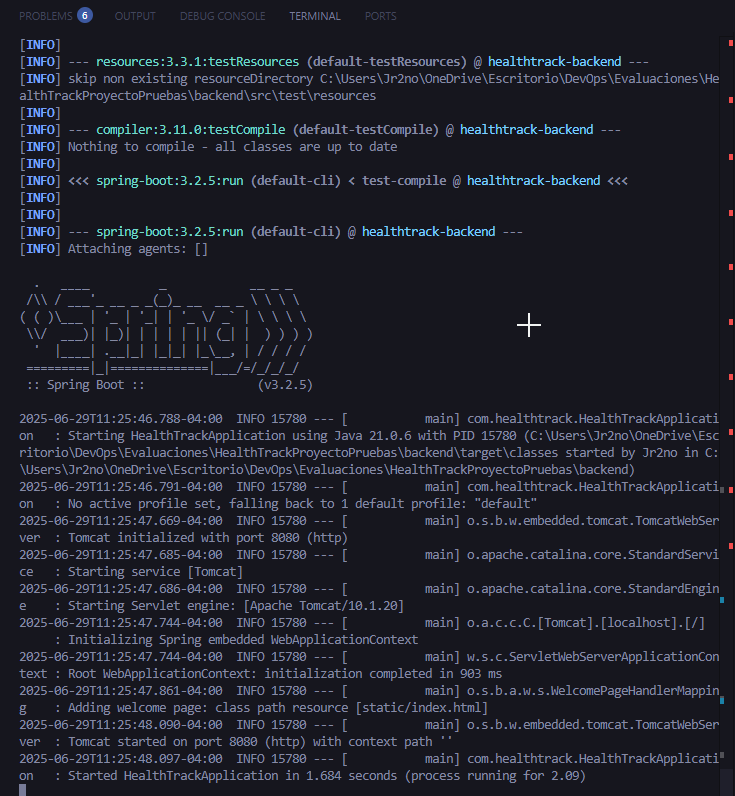
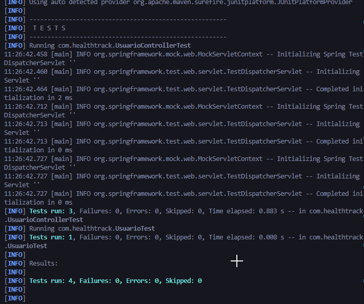
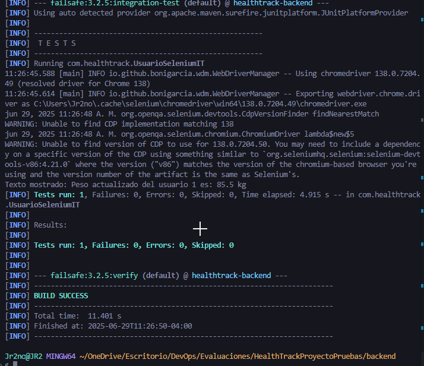
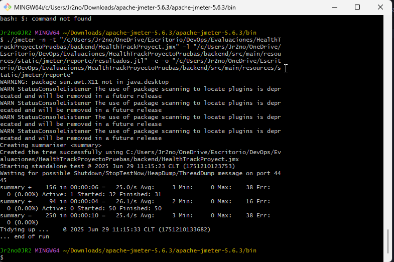
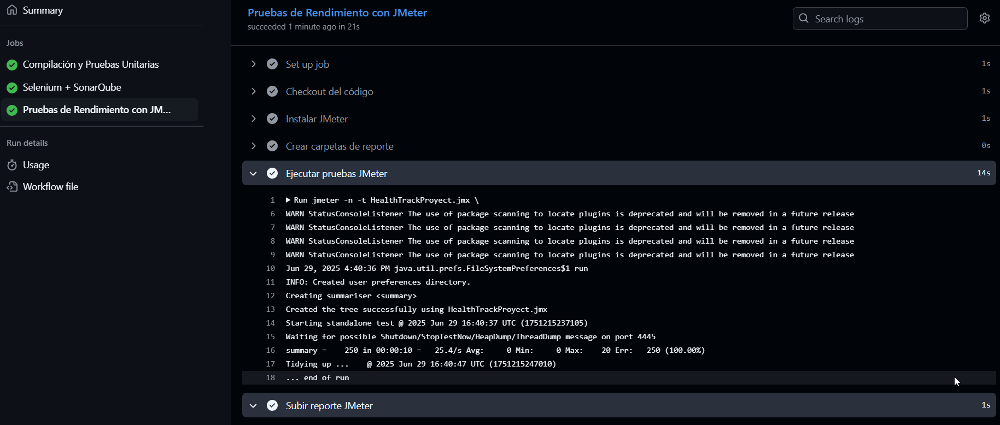
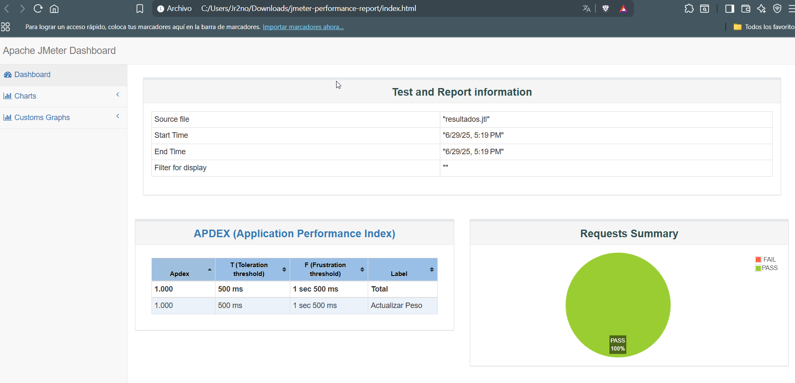
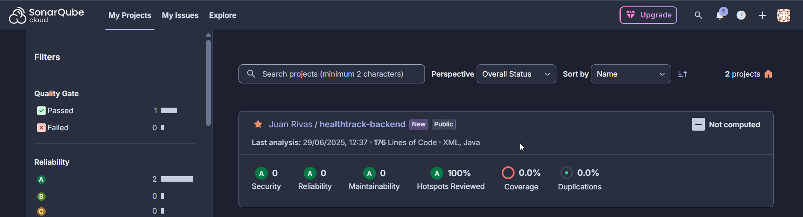
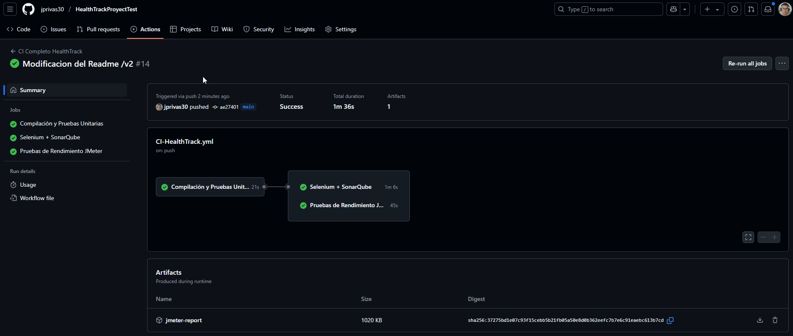
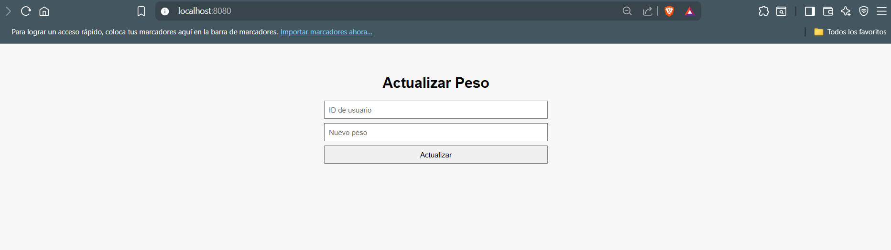

# 🏥 HealthTrack - Plataforma de Monitoreo de Peso

HealthTrack es una plataforma web diseñada para que los usuarios puedan monitorear su peso corporal periódicamente. Como parte de una evaluación de automatización de pruebas en un entorno DevOps, este repositorio incluye pruebas automatizadas, corrección de errores, un pipeline CI/CD y análisis de calidad de código.

---

## 🎯 Objetivos del Proyecto

- Identificar y corregir errores en la lógica del sistema de actualización de peso.
- Implementar un conjunto completo de pruebas automatizadas: unitarias, funcionales, de regresión y de rendimiento.
- Automatizar el proceso de validación continua del código mediante un pipeline CI/CD.
- Mejorar la calidad del código utilizando herramientas de análisis estático.

---

## 🧪 Pruebas Automatizadas Implementadas

| Tipo de Prueba     | Herramienta         | Descripción |
|--------------------|---------------------|-------------|
| ✅ Unitarias        | JUnit               | Validan la lógica de actualización de peso y otros métodos críticos. |
| ✅ Funcionales      | Selenium            | Simulan interacciones de usuarios en el flujo de actualización de peso. |
| ⚠️ De Regresión     | (*Estrategia*)      | Se contempla como conjunto de unitarias para detectar futuros errores. |
| ✅ Rendimiento      | Apache JMeter       | Evalúa el comportamiento del sistema bajo carga y latencia. |

---

## 🔧 Tecnologías Utilizadas

- **Lenguaje principal:** Java 21
- **Framework Backend:** Spring Boot 3.2.5
- **Pruebas unitarias:** JUnit 5
- **Automatización de UI:** Selenium + WebDriverManager
- **Pruebas de rendimiento:** Apache JMeter 5.6.3
- **Automatización CI/CD:** GitHub Actions
- **Calidad del código:** SonarQube
- **Build Tool:** Apache Maven

---

## 🚀 Pipeline CI/CD

El proyecto cuenta con un pipeline automatizado que se ejecuta al hacer push a la rama `main`. El flujo incluye:

1. Compilación del proyecto (`mvn clean install`)
2. Ejecución de pruebas unitarias y funcionales
3. Análisis de calidad del código con SonarQube
4. Pruebas de rendimiento con JMeter
5. Generación de reportes y artefactos

---

## 🖼️ Imagenes del proceso

- SpringBoot

- Junit

- Selenium

- Jmeter

- SonarQube

- GitHub Actions

- App Corriendo

## 📊 Link del informe: 

- https://docs.google.com/document/d/1pJJOekh5JDO1-OI6CUMgcvK8TCehNTnSPAaB_5kzGwY/edit?usp=sharing

